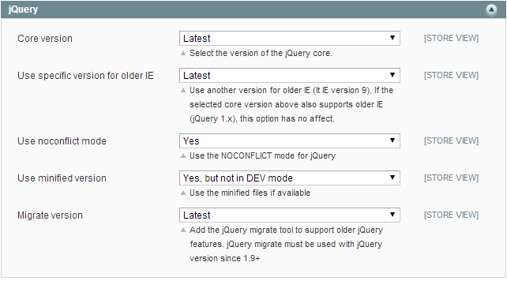
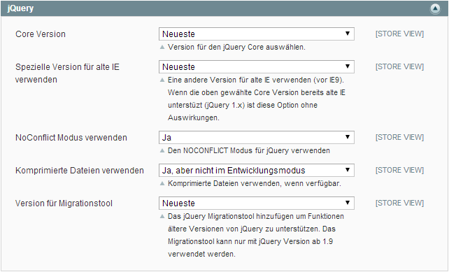

LibJquery
=========

Adds jQuery core files and allows version selection via backend.

Coming soon: blogpost on www.magegyver.de:

You can
* enable/disable usage of jQuery via backend
* choose any version jQuery, including beta versions
* choose a specific version for older IE (lt 9)
* toggle invoking `$.noConflict();` after loading the core
* automatic use minified files (if available)
* use the migrate tool for newest core version to support old jQuery features
